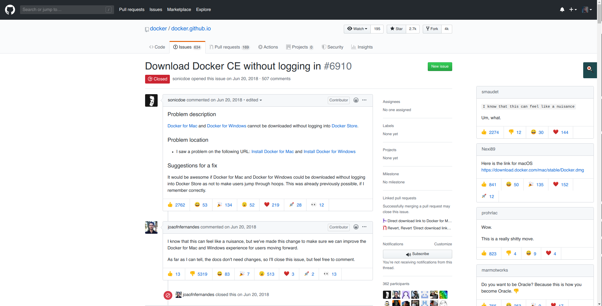

# Issue Inspector

Instantly find the solution you're looking for in github issues.

Issue Inspector ranks each comment on issues by the reactions. Comments with many 👍 and ❤️ are probably solutions so they go at the top.

## WIP

This project is still a work in progress, the unlisted chrome extension can be downloaded from [here](https://chrome.google.com/webstore/detail/issue-inspector/jcekpjkpiblmimjfbejfdkngbmdgaeen)

## TODO

- [x] Show relevant comments in order
- [x] Add a button for collapsing the previews
- [ ] Tweak the weights further
- [ ] Add persistence for visibility toggle?

